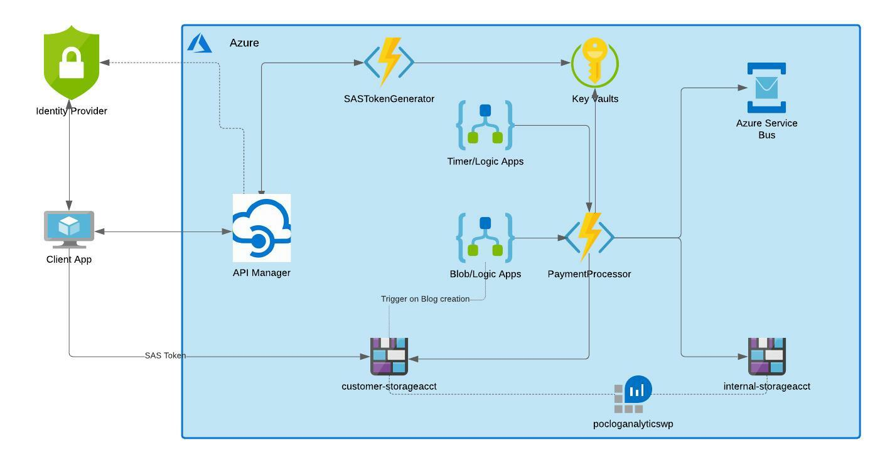

# azure-blob-logicapps-functions

APIM receives a request from a third party. 
Request is authenticated and an OAuth2 token returned (integration via IdP integration). 
APIM calls a function to generates a Shared Access Signature (SAS) with limited time (1 minute). 

Third party uploads an encrypted blog to the client facing blob storage account. 
Logic Apps running azure function (PaymentProcessor) when a blog is added to Blob Storage Account. 

The funtion PaymentProcessor:
1) Retrieves encryption key from key vault and decrypt file
2) Performs any required validation prior to submission for onward processing
    - Saves file to storage
    - Places message on queue

    